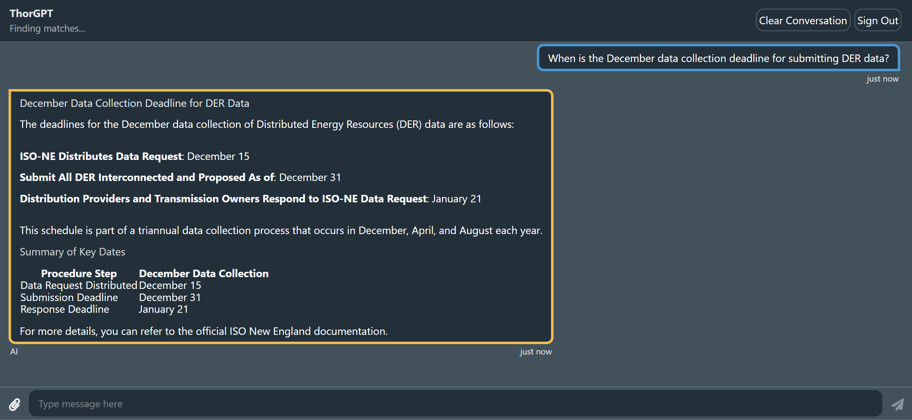
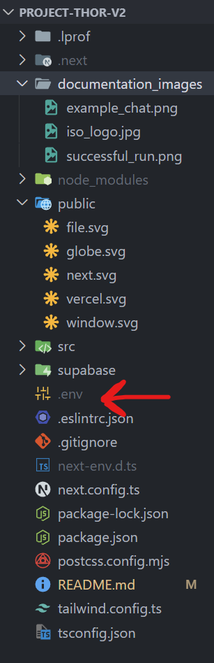

# Welcome to Project Thor!

Project Thor is a chatbot for retrieving information from ISO New England's [rules and procedures](https://www.iso-ne.com/participate/rules-procedures). It takes a conversational approach to surfacing critical information about various regulations that would be otherwise difficult to find when rules and regulations are spread across so many different resources on the ISO website.

<!-- TODO: add better example image, this answer may be slightly incorrect. -->

## Getting Started

Getting Project Thor up and running is very straightforward:

1. `git clone` this repository to your local machine
2. Run `npm install` in a terminal in the cloned folder
   1. If you receive an error here about your Node.js version at this step, go to [this website](https://nodejs.org/en) to update your Node version
3. Retrieve the `.env` file from this  google drive folder [Google Drive Link](https://drive.google.com/drive/folders/1sdEnDH9pb2lWvhiTuz8H8wDrXKsc2zvy?usp=sharing), download it, change the .txt extension to a dot file, and paste it in the root directory of `project-thor-v2`:

> [!WARNING]
> Please do not share or upload this .env file anywhere as it contains private keys.

4. Run `npm run dev` at the same terminal location as step 2 and wait for the terminal's `Ready in [SECONDS]s` message (the second green-checked message pictured below).
 
5. Open your browser of choice (e.g., Google Chrome) and go to the url [http://localhost:3000](http://localhost:3000)
6. Once ThorGPT is open, you will be prompted to login. For testing purposes, please refer to the login credentials in the "Credentials" document in the [same folder we stored the .env file in](https://drive.google.com/drive/folders/1PrpMbe5DQK8nIjpgg_kb3dzP70Vpoco1?usp=sharing). Or simply, use the UI to create a new user.

7. After logging in, you should be faced with the ChatGPT-style chat window. Start asking questions about ISO New England (see the sample chat above)! Make sure to press "Clear Conversation" in the top right if you'd like to clear any past conversation.

> [!IMPORTANT]
> This project is forked over from a Supabase Langchain demo and much of the original code exists in our chatbot. The only changes we made were updating every dependency and using a Langgraph Agent Style Approach instead of Langchain for our RAG Pipeline.
> Visit [Supabase Langchain Demo](https://github.com/supabase-community/langchain-chatbot-demo) for the original demo code.

