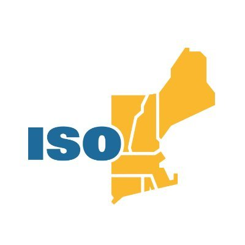

# Welcome to Project Thor!

Project Thor is a chatbot for retrieving information from ISO New England's [rules and procedures](https://www.iso-ne.com/participate/rules-procedures). It takes a conversational approach to surfacing critical information about various regulations that would be otherwise difficult to find when rules and regulations are spread across so many different resources on the ISO website.

<!-- TODO: add better example image, this answer may be slightly incorrect. -->

## Getting Started

Getting Project Thor up and running is very straightforward:

1. `git clone` this repository to your local machine
2. Run `npm install` in a terminal in the cloned folder
   1. If you receive an error here about your Node.js version at this step, go to [this website](https://nodejs.org/en) to update your Node version
3. Run `npm run dev` at the same terminal location as step 2 and wait for the terminal's `Ready in [SECONDS]s` message (the second green-checked message pictured below).
 
4. Open your browser of choice (e.g., Google Chrome) and go to the url [http://localhost:3000](http://localhost:3000)
5. TBD (env file link?)
